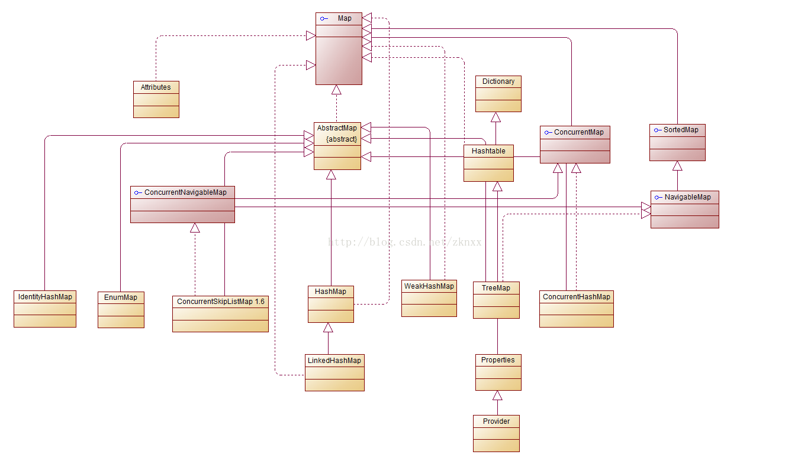

#### map学习
*  类图：

#### 各个类介绍：
*  Map：基类，基本操作：size、isEmpty、get、containsKey、containsValue、put、remove...等等增删查改接口定义
*  AbstractMap: Map的实现类（这里先不做研究）
*  SortedMap：接口类（有序）
*  HashMap: 基于哈希表实现，线程不安全
*  ConcurrentHashMap：线程安全
*  Hashtable：线程安全
*  TreeMap：实现树操作的Map类：可排序、线程不安全

#### 对比：
*  HashMap和Hashtable：
  *  前者是线程不安全的
  *  从功能上讲，没有本质的区别，考试的时候，可以不需要
*  几种哈希Map的区别：
  *  HashMap：最基本的HashMap类，无序的、线程不安全的
  *  LinkedHashMap：有序的，线程安全的
  *  WeakHashMap：可以实现弱键回收
  *  ConcurrentHashMap：线程安全、便于并发处理
  *  IdentityHashMap：key值可以重复